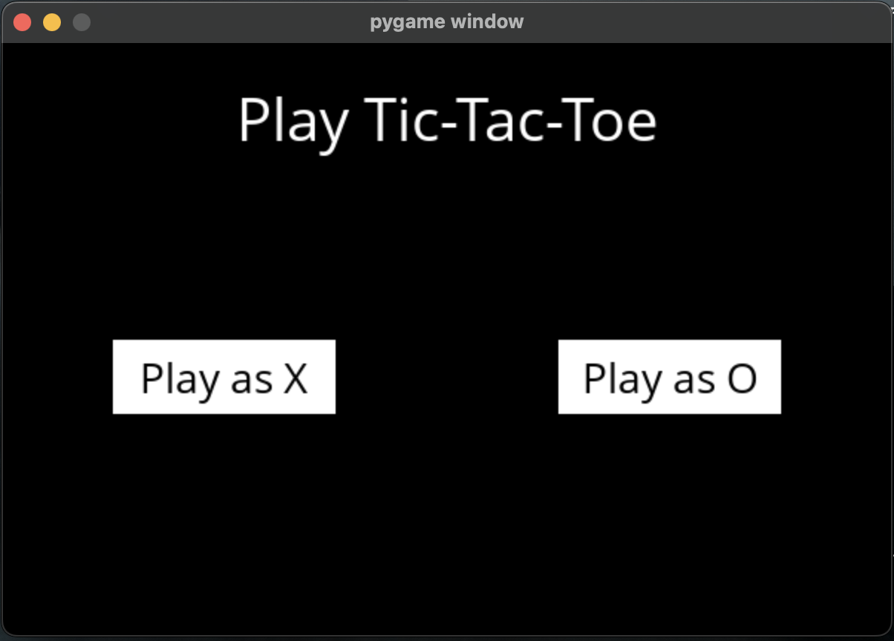
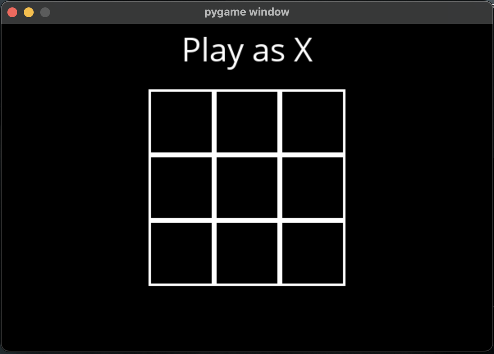
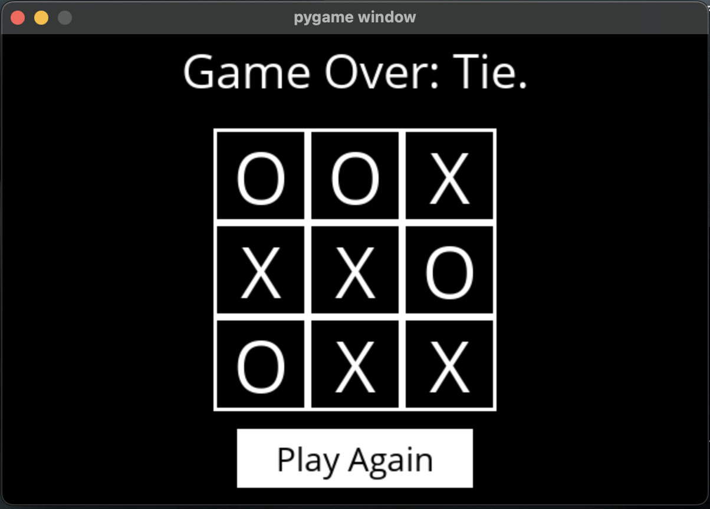

# Tic-Tac-Toe Interactive Game Using Minimax Algorithm

This is a simple implementation of the Tic-Tac-Toe game using the Minimax algorithm. The game is played GUI built using the pygame library. The Minimax algorithm is used to determine the best possible move for the computer player.

The Minimax algorithm is a decision-making algorithm that is used for finding the best move for a player, assuming that the opponent (the human user) also plays optimally. The algorithm is used in two-player games, such as Tic-Tac-Toe, to determine the best possible move for the computer player.

## Screenshots





## Requirements

- Python 3.x
- Pygame

## How to run

1. Clone the repository
2. Install the required libraries using the following command:

```bash
pip install -r requirements.txt
```

3. Run the game using the following command:

```bash
python runner.py
```

## How to play

- The game is played on a 3x3 grid.
- The user can play as either X or O.
- The result of the game is displayed at the end of the game. Either the user wins, the computer wins, or it's a tie.

## Author

Zaid Ghazal - [LinkedIn](https://www.linkedin.com/in/zaid-ghazal/)
